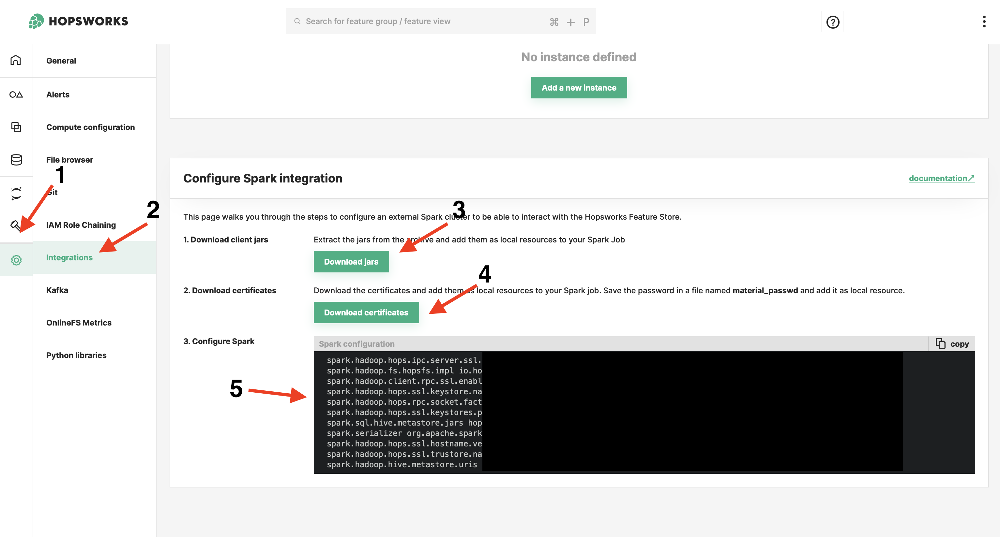

## <span style='color:#ff5f27'> 👨🏻‍🏫 DBT Tutorial with BigQuery </span>

This tutorial shows you how to perform feature engineering in DBT on BigQuery, storing offline computed features in a table in BigQuery (that is mounted as an external feature group in Hopsworks) and online features in Hopsworks. The online features are written to Hopsworks using a Python module that is run on a DataProc cluster. The feature group created in Hopsworks has its offline data stored in BigQuery and its online data stored in Hopsworks online store (RonDB).

### <span style='color:#ff5f27'> 🏡 Cluster setup </span>

First, you need to setup a Dataproc (Spark) cluster that will run the Python model in our DBT workflow. The Python model will write to the online feature store in Hopsworks.

Navigate to **Project Settings** and then **Integrations**. At the bottom of the page you will find necessary files which you need to attach to your Dataproc cluster.



You can find the code to create the Dataproc cluster in `provision.sh`.

To make `provision.sh` file executable, run the following command:

`chmod +x provision.sh`

Fill in your cluster information and then run the `./provision.sh` command.

### <span style='color:#ff5f27'>📡 DBT Setup </span>

Install the BigQuery adapter by running
`pip install dbt-bigquery`

Create a new profile inside your ~/.dbt/profiles.yml file.

```
{YOUR_DBT_PROJECT_NAME}:
 target: dev
 outputs:
   dev:
     # Type of DBT connector (BigQuery, Snowflake, etc)
     type: bigquery
     # Authentication method 
     method: service-account-json
     # Your Google Cloud project id
     project: [YOUR_GCP_PROJECT_ID]
     # Your BigQuery dataset name
     dataset: {YOUR_DATASET_NAME}
     threads: 1


     # These fields come from the service account json keyfile
     keyfile_json:
       type: xxx
       project_id: xxx
       private_key_id: xxx
       private_key: xxx
       client_email: xxx
       client_id: xxx
       auth_uri: xxx
       token_uri: xxx
       auth_provider_x509_cert_url: xxx
       client_x509_cert_url: xxx


     # Your Bucket name
     gcs_bucket: {YOUR_BUCKET_NAME}
     # Your Dataproc region
     dataproc_region: {YOUR_DATAPROC_REGION} 
 ```


### <span style='color:#ff5f27'>⚙️ DBT Launch </span>

Fill in `read_bigquery_data.sql` and `data_pipeline.py` files with your feature engineering code that creates features and writes them to the BQ offline table and Hopsworks online table.

Use the next command to run DBT models pipeline:

`dbt run`

You will see the next output:


> To see the job logs, check your cluster **Job details**.
